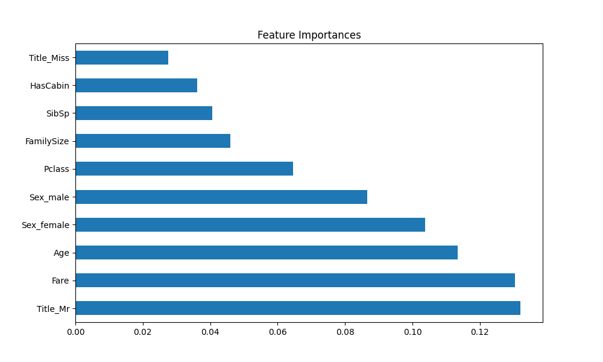
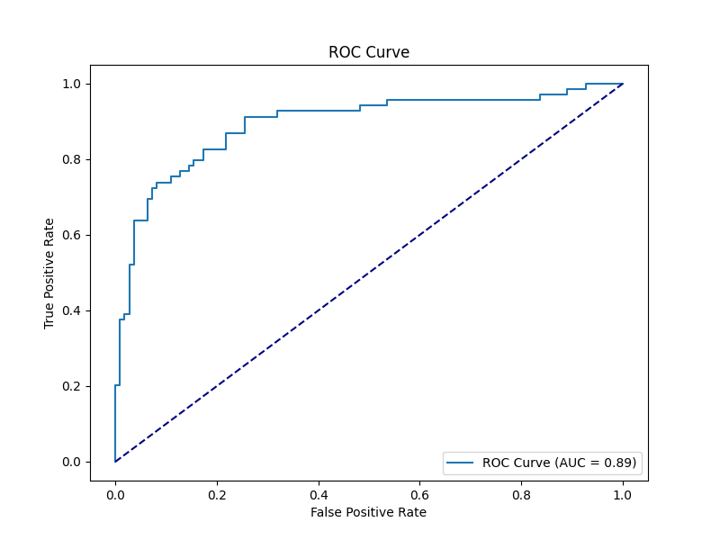
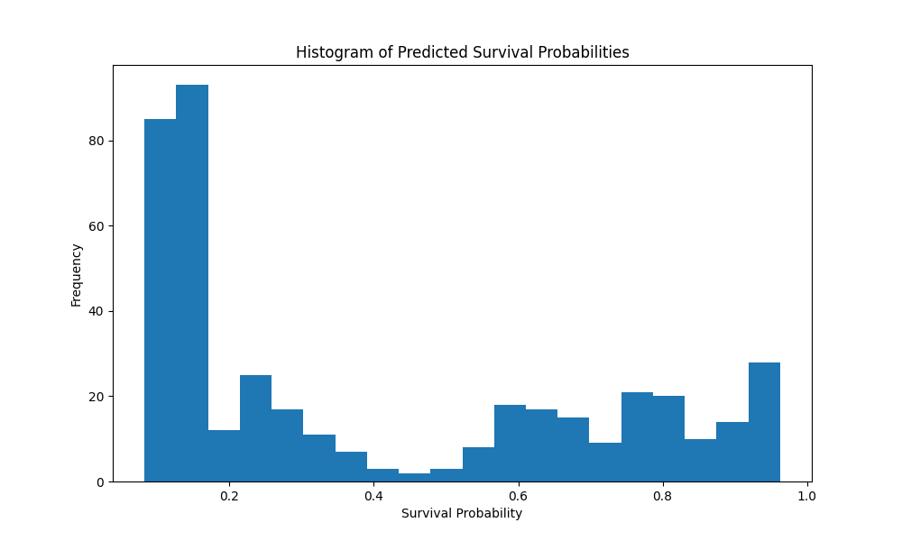

# Titanic Survival Prediction Project

## Overview
This project is an approach to the [Kaggle Titanic competition](https://www.kaggle.com/c/titanic), aiming to predict the survival of passengers aboard the Titanic using machine learning techniques. The project involves data preprocessing, feature engineering, model training with a RandomForestClassifier, and predicting survival outcomes.

## Data Description
The project utilizes the Titanic dataset from Kaggle, obtained via `kaggle competitions download -c titanic`. From Kaggle:
> - `train.csv` contains the details of a subset of the passengers on board (891 to be exact) and importantly, will reveal whether they survived or not, also known as the "ground truth".
> - The `test.csv` dataset contains similar information but does not disclose the "ground truth" for each passenger. It's your job to predict these outcomes.
- `gender_submission.csv`: The expected submission format.


## Model Details
The model is a RandomForestClassifier from scikit-learn, trained with 100 trees and a maximum depth of 10 (`RandomForestClassifier(n_estimators=100, max_depth=10, random_state=1)`). The model is trained in `src/train.py` and persisted to `models/titanic_model.pkl`.

## Model Performance
The RandomForestClassifier model achieves an accuracy of **0.85**.

### Visual Insights
The following images were generated during the most recent model evaluation:

- 
    *Feature Importances:* This bar chart ranks the features by their importance in the RandomForestClassifier model. The length of the bar represents the feature's weight in the model, with `Title_Mr`, `Fare`, and `Age` being among the most influential for predicting survival on the Titanic. Notably, `Title_Mr` emerges as a significant predictor — a result of extracting titles from passenger names and applying one-hot encoding during the preprocessing phase, as defined in **src/features.py**'s `extract_title()`.


- 

    *Confusion Matrix: (0 for not survived, 1 for survived). The y-axis represents the actual labels.*

    - **True Negatives (TN)**: The model correctly predicted 102 passengers as not survived.
    - **False Positives (FP)**: The model incorrectly predicted 8 passengers as survived when they didn't.
    - **False Negatives (FN)**: The model incorrectly predicted 19 passengers as not survived when they did survive.
    - **True Positives (TP)**: The model correctly predicted 50 passengers as survived.


- 
    *ROC Curve: Evaluating Model's Diagnostic Ability*

    - **True Positive Rate (TPR)**: Reflects the proportion of actual positives correctly identified by the model. 
    - **False Positive Rate (FPR)**: Indicates the proportion of actual negatives incorrectly labeled as positives by the model.
    - **AUC Score**: Represents the Area Under the ROC Curve (AUC = 0.89), quantifying the overall ability of the model to discriminate between the positive and negative classes.
    - **Curve Interpretation**: The closer the curve follows the left-hand border and then the top border of the ROC space, the more accurate the test. Conversely, a curve near the 45-degree diagonal represents a model with no discriminative ability (equivalent to random guessing).


- 
    *Histogram of Predicted Survival Probabilities: Analyzing the Spread of the Model's Predictions*

    - This histogram shows the distribution of the predicted probabilities for survival by the model.

## Testing

### Automated Tests
`tests/` directory contains automated tests.

To run the tests, navigate to the project root and execute the following command:
```sh
python -m unittest discover -s tests
```

## Scripts and Functionality
- `main.py`: Orchestrates the data loading, preprocessing, model training, evaluation, and prediction generation. It uses various modules from the `src/` directory for different steps in the workflow.
- `user_passenger.py`: Allows users to input passenger details and receive a survival prediction. It utilizes the trained model saved in `models/titanic_model.pkl`.
- `src/evaluate_model.py`: Contains functions for model evaluation, including accuracy calculation.
- `src/feature_selection.py`: (Unused) Implements feature selection using Recursive Feature Elimination (RFE).
- `src/features.py`: Contains feature engineering functions, including title extraction, family size calculation, and age/fare binning.
- `src/preprocess.py`: Manages data preprocessing, including handling missing values and one-hot encoding of categorical variables.
- `src/train.py`: Handles the training of the RandomForestClassifier model and its persistence.
- `src/visualize.py`: Generates visualizations like feature importances, confusion matrix, ROC curve, and survival probability histogram, saving them to the `outputs/` directory.

## Output Images
The `outputs/` directory contains visualizations generated for model interpretation:
- `confusion_matrix.png`: Model's confusion matrix.
- `feature_importances.png`: Importance of different features in the model.
- `roc_curve.png`: ROC curve for model performance evaluation.
- `survival_histogram.png`: Histogram of predicted survival probabilities.

## Setup and Prerequisites
To set up the project:
1. Clone the repository.
2. Install dependencies specified in `pyproject.toml` using Poetry.
3. Run `poetry run python main.py` for training and predictions on the test set or `poetry run python user_passenger.py` for custom predictions.

### Important Notes on Model Usage
- Running `main.py` will train the model and create `models/titanic_model.pkl`, which is essential for `user_passenger.py` to function.
- `user_passenger.py` relies on the existence of `models/titanic_model.pkl` to make predictions based on user input.

## Usage
- `main.py`: Trains the model and generates predictions on the test dataset. Outputs a submission file.
- `user_passenger.py`: Takes user input for a single passenger and outputs the survival probability.

## Additional Notes
This project is an initial implementation of the Titanic survival prediction. Ideally, this model will someday achieve a perfect accuracy score!

---

*For more detailed information about the scripts and model training, please refer to the source code within the `src/` directory.*
