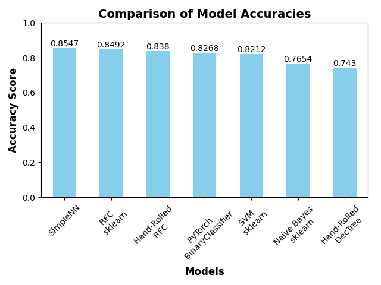
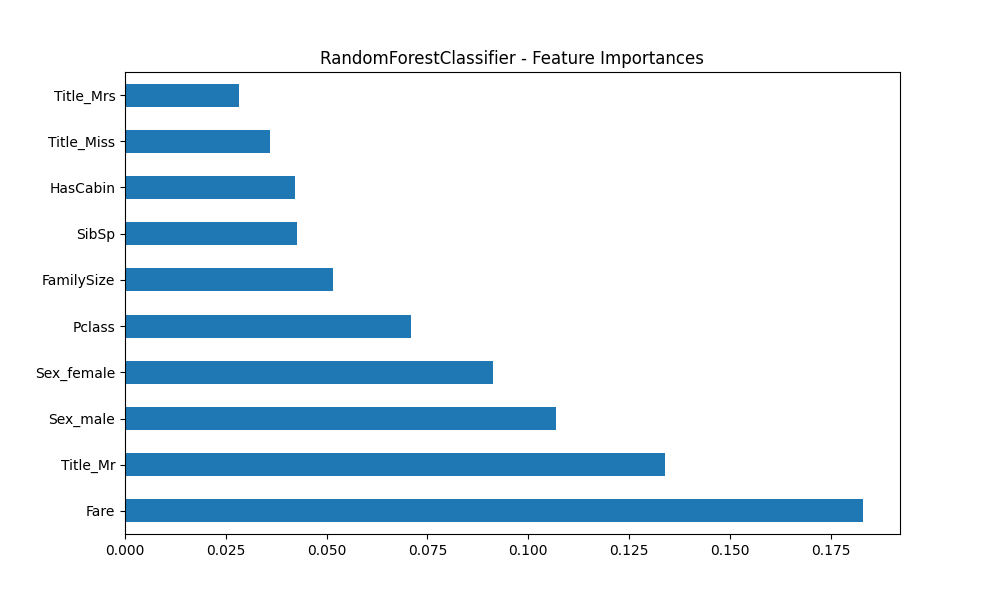
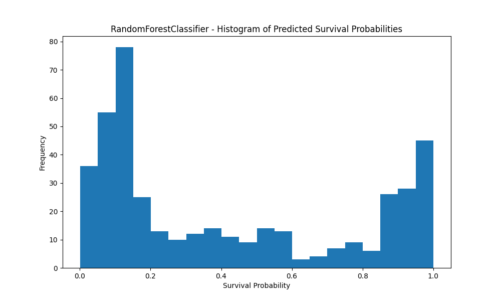

# Titanic Survival Prediction Project

## Overview
This project is an approach to the [Kaggle Titanic competition](https://www.kaggle.com/c/titanic), aiming to predict the survival of passengers aboard the Titanic using machine learning techniques. The project involves data preprocessing, feature engineering, model training, and predicting survival outcomes. Models range from traditional models like RandomForest and SVM to custom implementations of decision trees and ensemble methods, to deep learning with PyTorch. My larger aim is to provide a comprehensive comparison of these methods by showcasing their functionalities and resulting performances.


## Model Details
- **RandomForestClassifier**:
The model is a [RandomForestClassifier from scikit-learn](https://scikit-learn.org/stable/modules/generated/sklearn.ensemble.RandomForestClassifier.html), trained with 100 trees and a maximum depth of 10 (`RandomForestClassifier(n_estimators=100, max_depth=10, random_state=1)`). The model is trained in `src/random_forest/rf_main.py` and persisted to `models/rf_titanic_model.pkl`. (`Accuracy: 0.85`)

- **Hand-Rolled Decision Tree Classifier**: A custom decision tree model is implemented from scratch, showcasing a more manual approach to classification. The model constructs a decision tree using Gini Impurity and Information Gain as metrics for optimal feature selection and splitting. The tree consists of `Leaf` and `Internal_Node` classes to handle predictions. The decision-making process traverses the tree, making decisions at each node based on the data until it reaches a leaf node. The model is detailed in `src/decision_tree/decision_tree.py` and demonstrates comparable performance to the SVM model (`Accuracy: 0.72`). [See Math Notes Wiki for split-algorithm details.](https://github.com/DeepBlockDeepak/kaggle_titanic/wiki/Decision-Tree-Math-Notes)

- **SVM (Support Vector Machine)**: The project incorporates a Support Vector Machine model using the [SVC class from scikit-learn](https://scikit-learn.org/stable/modules/generated/sklearn.svm.SVC.html#sklearn.svm.SVC). The SVM model is configured with an RBF kernel (`kernel='rbf'`), a scale gamma value (`gamma='scale'`), and a regularization parameter C set to 1 (`C=1`). This model is particularly effective for high-dimensional spaces and is implemented in `src/svm/svm_train.py`. It is trained and evaluated in a similar fashion to the RandomForestClassifier. (`Accuracy: 0.73`)

- **Hand-Rolled RandomForestClassifier**: An extension of the hand-rolled Decision Tree Classifier, this model implements the RandomForest algorithm from scratch. It constructs multiple decision trees on bootstrapped samples of the dataset and uses majority voting for classification. This approach demonstrates the power of ensemble learning in improving prediction accuracy and robustness over individual decision trees. The implementation can be found in `src/rfc_hand_rolled/random_forest.py`. (Accuracy: Reaches as high as **0.87**)

- **Naive Bayes**: Utilizes the probabilistic Naive Bayes algorithm for classification, making the strong assumption that features are independent given the class label. Despite its simplicity, this model shows effective performance on the Titanic dataset. The training and evaluation process is handled in `src/naive_bayes/bayes_main.py`.

- **Naive Bayes**: This model uses [`GaussianNB` scikit-learn](https://scikit-learn.org/stable/modules/generated/sklearn.naive_bayes.GaussianNB.html), a probabilistic classifier based on applying Bayes' theorem with the assumption of independence between features.

- **PyTorch Binary Classifier**: A [PyTorch Neural Network model](https://pytorch.org/docs/stable/nn.html), designed for binary classification tasks. The network architecture consists of an input layer adapted to the dataset's feature size, a hidden layer with 64 neurons, ReLU activation for introducing non-linearity, dropout for regularization, and a sigmoid output layer for probability prediction. The structure and training process are in `src/pytorch/pytorch_binary.py`.


## Model Performance
The project features three distinct models: RandomForestClassifier, SVM, and a hand-rolled Decision Tree Classifier. Each model has been evaluated for its accuracy:
- The RandomForestClassifier Accuracy : **0.85**
- Hand-rolled Decision Tree Classifier : **0.72**
- Hand-rolled RFC : as high as **0.87** !
- SVM : **0.73**
- Naive Bayes : **0.68**
- PyTorch BinaryClassifier Accuracy: **0.81**


## Visual Insights



***Model Accuracy Comparison:*** A comparative view of the accuracy scores achieved by each model.



***Feature Importances:*** This bar chart ranks the features by their importance in the RandomForestClassifier model. The length of the bar represents the feature's weight in the model, with `Title_Mr`, `Fare`, and `Age` being among the most influential for predicting survival on the Titanic. Notably, `Title_Mr` emerges as a significant predictor — a result of extracting titles from passenger names and applying one-hot encoding during the preprocessing phase, as defined in **src/features.py**'s `extract_title()`.


***Confusion Matrix:*** *(0 for not survived, 1 for survived). The y-axis represents the actual labels.*

- **True Negatives (TN)**: The model correctly predicted 102 passengers as not survived.
- **False Positives (FP)**: The model incorrectly predicted 8 passengers as survived when they didn't.
- **False Negatives (FN)**: The model incorrectly predicted 19 passengers as not survived when they did survive.
- **True Positives (TP)**: The model correctly predicted 50 passengers as survived.


***ROC Curve:*** *Evaluating Model's Diagnostic Ability*

- **True Positive Rate (TPR)**: Reflects the proportion of actual positives correctly identified by the model. 
- **False Positive Rate (FPR)**: Indicates the proportion of actual negatives incorrectly labeled as positives by the model.
- **AUC Score**: Represents the Area Under the ROC Curve (AUC = 0.89), quantifying the overall ability of the model to discriminate between the positive and negative classes.
- **Curve Interpretation**: The closer the curve follows the left-hand border and then the top border of the ROC space, the more accurate the test. Conversely, a curve near the 45-degree diagonal represents a model with no discriminative ability (equivalent to random guessing).



***Histogram*** *of Predicted Survival Probabilities*

- This histogram shows the spread of the predicted probabilities for survival by the RF model.


## Data Description
The project utilizes the Titanic dataset from Kaggle, obtained via `kaggle competitions download -c titanic`. From Kaggle:
> - `train.csv` contains the details of a subset of the passengers on board (891 to be exact) and importantly, will reveal whether they survived or not, also known as the "ground truth".
> - The `test.csv` dataset contains similar information but does not disclose the "ground truth" for each passenger. It's your job to predict these outcomes.
- `gender_submission.csv`: The expected submission format.


## Setup and Prerequisites
To set up the project:
1. Clone the repository.
2. Install dependencies specified in `pyproject.toml` using Poetry with:
```bash
poetry install
```
3. Run 
```bash
poetry run python main.py
``` 
for training and predictions on the test set or 
```bash
poetry run python user_passenger.py
```
for custom predictions.


## Scripts and Functionality
The project is structured to provide a comprehensive approach to the Titanic survival prediction task. Key components and their functionalities are as follows:

- `main.py`: Central entry point. It handles data loading, preprocessing, model training, evaluation, and prediction generation. The script is versatile, allowing users to select between RandomForestClassifier, SVM, Decision Tree, or to compare all models by using the `--model` argument. Outputs a `./submission.csv` file for the test set predictions for the Kaggle submission.

**Example Usage:**
```bash
poetry run python main.py --model random_forest
```
```bash
poetry run python main.py --model decision_tree
```
```bash
poetry run python main.py --model svm
```
```bash
poetry run python main.py --model custom_rfc
```
```bash
poetry run python main.py --model naive_bayes
```
```bash
poetry run python main.py --model pytorch
```
```bash
poetry run python main.py # defaults to random_forest
```


- `rf_hyperparameter_tuning.py`: This script utilizes [GridSearchCV from scikit-learn](https://scikit-learn.org/stable/modules/generated/sklearn.model_selection.GridSearchCV.html) to exhaustively search through a predefined grid of hyperparameters and find the combination that yields the best performance. The script processes the training data, splits it for validation, and applies a grid search on the RandomForestClassifier. Interestingly, this script doesn't not produce a more accurate model than that provided with default values inside of [Random Forest Main Script](src/random_forest/rf_main.py)

- `user_passenger.py`: Takes user input for a single passenger and outputs the survival probability.

## Code Formatting and Linting

### Installing Code Formatters and Linters
This project uses `isort`, `black`, and `ruff` to maintain code quality and consistency. To install these tools, run the following command:

```bash
poetry add --dev isort black ruff
```

Before committing your code, please run the following commands to ensure consistency in code style and quality:

```bash
# Format and lint code
echo "Running isort for import sorting..."
poetry run isort .

echo "Running black for code formatting..."
poetry run black .

echo "Running ruff for linting..."
poetry run ruff .
```


## Testing

### Automated Tests
`tests/` directory contains automated tests.

To run the tests, navigate to the project root and execute the following command:
```sh
python -m unittest discover -s tests
```


## Additional Notes
This project is an initial implementation of the Titanic survival prediction. Ideally, this model will someday achieve a perfect accuracy score!

---

*For more detailed information about the scripts and model training, please refer to the source code within the `src/` directory.*
